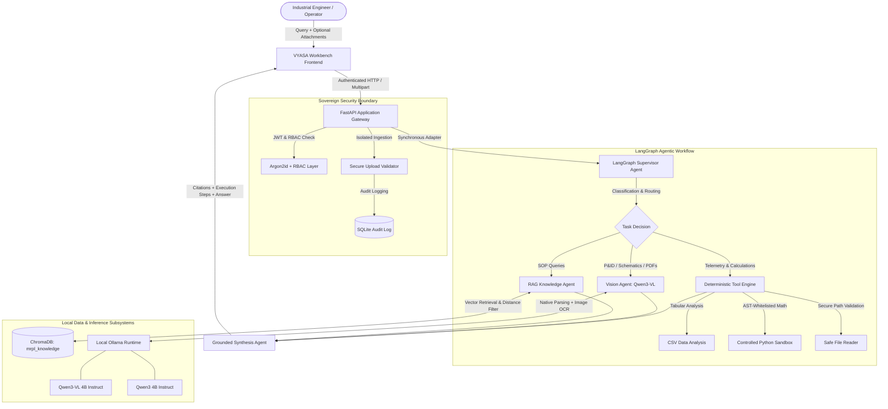
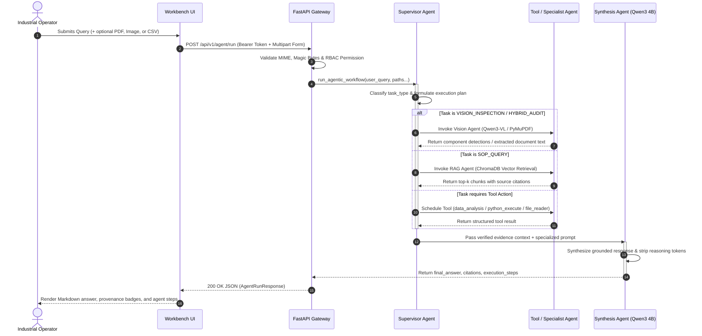

# VYASA
### Vision-augmented Yield & Agentic Synthesis Architecture

> **Sovereign On-Premise Agentic AI Workbench using Open-Weight Multimodal LLMs for Confidential Industrial Work**  
> **Smart India Hackathon (SIH) 2026** | **Problem Statement ID:** `SIH 26117`  
> **Status:** Stable Working Prototype (Phase B1 Frozen & Multimodal Verified)

---

## 1. Problem Statement

In mission-critical industrial facilities—such as oil refineries, petrochemical complexes, thermal power stations, and defense manufacturing plants—operational personnel manage complex daily workflows across proprietary Standard Operating Procedures (SOPs), process and instrumentation diagrams (P&IDs), operational logs, and machine telemetry.

Deploying commercial cloud-hosted AI services in these environments presents critical barriers:
- **Data Sovereignty & Air-Gap Compliance:** Operational data, equipment schematics, and incident reports are confidential corporate assets that cannot be transmitted over public internet connections or processed by commercial third-party cloud APIs.
- **Hallucination in Critical Operations:** Standard generative models frequently fabricate plausible-sounding parameters, posing severe safety hazards when evaluating flare velocities, operating temperatures, or pressure limits.
- **Multimodal Isolation:** Industrial knowledge is inherently multimodal. Procedures live in multi-page PDF documents, physical layouts exist in complex engineering schematics, and machinery status is captured via telemetry CSVs or on-site imagery. Single-modality text chatbots cannot cross-reference these domains.
- **Lack of Verifiable Grounding:** Operators require transparent provenance—exact source document names, specific page numbers, and auditable reasoning steps—before acting on automated recommendations.

---

## 2. Our Solution — VYASA

**VYASA (Vision-augmented Yield & Agentic Synthesis Architecture)** is an on-premise, air-gapped agentic AI workbench prototype engineered specifically for confidential industrial operations. Built entirely on top of open-weight multimodal foundation models, local vector stores, and deterministic tool execution sandboxes, VYASA ensures that **zero telemetry, documentation, or operational queries ever leave the local network boundary**.



---

## 3. Working Prototype

VYASA is a fully functional prototype running entirely on local developer and on-premise workstations. The system integrates a React/Vite workbench UI with a secured FastAPI gateway, LangGraph supervisor runtime, ChromaDB vector store, and local Ollama inference server.

### Workbench Interface
<!-- TODO: Add Workbench screenshot here -->
> 📸 Screenshot to be added: `assets/screenshots/workbench_dashboard.png`  
*The central operator console displaying session identity, system health status, drag-and-drop file ingestion, and the multi-agent reasoning timeline.*

### Text Interaction
<!-- TODO: Add Text Interaction screenshot here -->
> 📸 Screenshot to be added: `assets/screenshots/text_interaction.png`  
*Direct conversational assistance for engineering terminology, plant physics, and conversational guidance with zero internal reasoning leakage.*

### PDF / Document Analysis
<!-- TODO: Add PDF Analysis screenshot here -->
> 📸 Screenshot to be added: `assets/screenshots/pdf_analysis.png`  
*Autonomous multi-page PDF ingestion, extracting text layers via PyMuPDF and utilizing Qwen3-VL for scanned technical documents to answer operational questions.*

### Vision / Image Analysis
<!-- TODO: Add Vision Analysis screenshot here -->
> 📸 Screenshot to be added: `assets/screenshots/vision_inspection.png`  
*Visual inspection of engineering P&ID diagrams and machine panels, identifying components (pumps, heat exchangers, valves) and extracting visual telemetry.*

### Knowledge Retrieval / RAG
<!-- TODO: Add Knowledge Retrieval screenshot here -->
> 📸 Screenshot to be added: `assets/screenshots/rag_retrieval.png`  
*Sovereign document retrieval over plant guidelines, returning verified technical limits with explicit source document attribution and page citations.*

### Data Analysis
<!-- TODO: Add Data Analysis screenshot here -->
> 📸 Screenshot to be added: `assets/screenshots/csv_data_analysis.png`  
*Deterministic tabular processing of industrial telemetry CSVs, executing threshold filtering, statistical summaries, and anomaly identification.*

### Controlled Python Execution
<!-- TODO: Add Controlled Python screenshot here -->
> 📸 Screenshot to be added: `assets/screenshots/controlled_python.png`  
*Sandboxed, AST-whitelisted Python evaluation for precise engineering calculations, unit conversions, and formula validation without arbitrary code execution.*

---

## 4. Key Capabilities

| Capability | Subsystem | Implemented Functionality in Prototype | Grounding & Verification |
| :--- | :--- | :--- | :--- |
| **Grounded Text Synthesis** | `agents/src/nodes.py` | Local generative synthesis via `qwen3:4b` using strict prompt personas. Strips internal `<think>` tokens and reasoning preambles. | Eliminates hallucinations; returns direct engineering facts. |
| **Sovereign Local RAG** | `rag/` & `agents/rag_tool.py` | Semantic search over local engineering guidelines using `SentenceTransformer('all-MiniLM-L6-v2')` and persistent ChromaDB. | Returns exact source filename and page numbers; enforces 1.2 distance ceiling. |
| **PDF Document Analysis** | `vision/` & `agents/vision_tool.py` | Ingests PDF documents up to page limit; extracts native text via PyMuPDF and rasters scanned pages to high-resolution pixmaps for visual reading. | Answers operator questions directly from document text. |
| **P&ID & Visual Inspection** | `vision/` & `agents/vision_tool.py` | Encodes equipment photos and schematics to base64 for local multimodal reasoning via `qwen3-vl:4b`. | Detects pumps, valves, heat exchangers, and instrument labels with confidence ratings. |
| **Tabular Data Analysis** | `agents/tools/data_analysis.py` | Deterministic CSV analysis supporting column inspection, row counts, missing-value profiling, numeric summaries, threshold filtering, and categorical aggregation. | Zero code execution; pure algorithmic evaluation on authorized CSV datasets. |
| **Controlled Python Sandbox** | `agents/tools/python_execution.py` | Sandboxed Python math execution using an AST whitelist. Supports arithmetic, trigonometry, log functions, and statistics. | Strict execution time budget (1.0s); blocks imports, loops, system calls, and file I/O. |
| **Safe File Reader** | `agents/tools/file_reader.py` | Restricted file reader for `.txt`, `.csv`, `.json`, `.pdf`, `.docx` within authorized workspace and temporary directories. | Anti-traversal verification; rejects paths outside authorized canonical roots. |
| **Multi-Agent Orchestration** | `agents/src/graph.py` | LangGraph compiled StateGraph with Supervisor planner, conditional routing, iterative tool feedback loops, and synthesizer node. | Exposes step-by-step agent trace to frontend (`Supervisor -> Tool -> Synthesis`). |
| **Authentication & RBAC** | `backend/app/core/` | User registration, login, session validation, and password hashing using Argon2id with expiring JWT bearer tokens. | Explicit roles (`admin`, `officer`, `worker`, `user`); restricts agent access to authorized roles. |
| **Security Audit Logging** | `backend/app/db/` | SQLite-backed immutable audit log capturing user ID, username, IP address, timestamp, action, and success/failure categories. | Administrator-accessible audit retrieval via `GET /api/v1/audit`. |

---

## 5. Agentic Workflow

VYASA implements an iterative, stateful multi-agent execution pipeline orchestrated with **LangGraph**:



### Agent Personas & Output Discipline
- **Supervisor Agent:** Evaluates user intent, file attachments, and numerical threshold syntax to direct tasks without engaging in open-ended generative chat.
- **RAG Knowledge Agent:** Queries indexed ChromaDB collections, filtering out low-similarity chunks (>1.2 distance).
- **Vision Agent (`Qwen3-VL 4B`):** Operates on image inputs and scanned PDF pixmaps to detect industrial symbols, equipment condition, and technical annotations.
- **Synthesis Agent (`Qwen3 4B`):** Formulates the final engineering response using persona-specific system prompts (`DOCUMENT_QA_SYNTHESIZER_PROMPT`, `IMAGE_SYNTHESIZER_PROMPT`, `TOOL_SYNTHESIZER_PROMPT`, `DIRECT_CHAT_SYNTHESIZER_PROMPT`). Enforces output hygiene by stripping internal thought traces.

---

## 6. Local RAG & Knowledge Grounding

The sovereign RAG subsystem indexes confidential technical documentation locally:

1. **Document Ingestion (`rag/.../src/text_chunker.py`):**
   - **PDF:** Page-by-page text extraction via PyMuPDF (`fitz`), tracking absolute page numbers.
   - **DOCX:** Native XML parsing of paragraph elements (`word/document.xml`) without external dependencies.
   - **TXT:** Direct UTF-8 ingestion with line-preserving normalizers.
2. **Chunking Strategy:**
   - Sliding window chunking with configurable chunk sizes (~500 characters) and overlaps (~100 characters).
   - Preserves source document metadata (`source`, `page`) on every chunk.
3. **Local Embeddings (`rag/.../src/embedder.py`):**
   - Model: `SentenceTransformer("all-MiniLM-L6-v2")` running locally via PyTorch.
   - Generates 384-dimensional dense semantic vectors.
4. **Vector Storage & Retrieval (`rag/.../src/search.py`):**
   - Storage Engine: **ChromaDB** with persistent on-disk storage (`data/chroma_db`).
   - Collection Name: `mrpl_knowledge`.
   - Query Filtering: Retrieves top-$k$ candidates, deduplicates normalized text chunks, and discards any chunk with distance $> 1.2$.
5. **Synthetic Demonstration Corpus:**
   - Included in `rag/.../data/synthetic_industrial_demo/` for safe testing:
     - `synthetic_flare_system_guideline.pdf` (Hydrogen flare seal velocities & limits)
     - `synthetic_pump_operating_sop.pdf` (Pump P-102 vibration warning thresholds)
     - `synthetic_compressor_operating_sop.pdf` (Compressor C-202 parameters)
     - `synthetic_pid_equipment_reference.pdf` (Standard symbols for valves, pumps, compressors)

---

## 7. Multimodal Processing Pipeline

VYASA seamlessly handles both document-based text and visual artifacts through a unified interface in [`agents/vision_tool.py`](file:///Users/anous/Desktop/programming/open_code/SIH/SIH-26117/agents/vision_tool.py):

### A. PDF & Technical Documents
- **Native Document Parsing:** Uses PyMuPDF to extract text layer by layer, preserving character counts and section headings.
- **Hybrid Scanned Handling:** If a PDF page contains no extractable text layer (e.g., legacy blueprints or scanned memos), the system renders the page to a 2× resolution PNG pixmap (`matrix=fitz.Matrix(2, 2)`) and feeds it directly into `qwen3-vl:4b` for visual OCR and diagram parsing.
- **Grounding Rule:** Answers are synthesized using `DOCUMENT_QA_SYNTHESIZER_PROMPT`, strictly prohibiting the introduction of external assumptions.

### B. Engineering Imagery & P&IDs
- **Image Formats Supported:** PNG, JPG, JPEG, WEBP.
- **Encoding & Inference:** Base64 encodes uploaded imagery and dispatches payloads to local Ollama inference (`POST /api/generate` with model `qwen3-vl:4b`).
- **Structured Extraction:** Parses visual equipment representations (boxes, triangles, pumps, valves) with associated confidence scores.

---

## 8. Security & Access Control

The workbench enforces defensive boundaries suited for confidential industrial environments:

### Authentication & Authorization (RBAC)
- **Password Storage:** Hashed using **Argon2id** (`pwdlib[argon2]`), resisting brute-force and GPU-accelerated dictionary attacks.
- **Session Tokens:** Stateless **HMAC-SHA256 JWT** bearer tokens with 60-minute expiration windows.
- **Role Hierarchy:**
  - `admin`: Full administrative access, audit log inspection, user management.
  - `officer`: Supervisory access, workflow execution, reporting.
  - `worker`: Authenticated field operator, authorized to execute agent workflows.
  - `user`: Basic unprivileged account; prohibited from running agent executions.

### File Ingestion Boundaries ([`backend/app/core/upload.py`](file:///Users/anous/Desktop/programming/open_code/SIH/SIH-26117/backend/app/core/upload.py))
- **Size Limits:** Enforces a hard 10 MB ceiling on uploaded assets (`MAX_UPLOAD_SIZE_BYTES`).
- **Extension Whitelist:** Rejects any extension outside `{ .png, .jpg, .jpeg, .webp, .pdf, .csv }`.
- **Magic Byte Validation:** Inspects real binary file headers:
  - PDF: verifies leading `%PDF-` bytes.
  - PNG: verifies `\x89PNG\r\n\x1a\n`.
  - JPEG: verifies `\xff\xd8\xff`.
  - WEBP: verifies `RIFF....WEBP`.
  - CSV: validates non-null UTF-8 tabular formatting.
- **Isolated Lifecycles:** Generates random UUID filenames in the operating system's temporary directory and unlinks files immediately upon request completion.

### Sandboxed Python Execution ([`agents/tools/python_execution.py`](file:///Users/anous/Desktop/programming/open_code/SIH/SIH-26117/agents/tools/python_execution.py))
- **AST Whitelist:** Parses abstract syntax trees before execution. Only allows numeric expressions, variable assignments, mathematical calls (`math.sqrt`, `math.sin`, etc.), and statistical primitives.
- **Prohibited Constructs:** Blocks `import`, `exec`, `eval`, `open`, `__import__`, list comprehensions, while/for loops, and system libraries (`os`, `sys`, `subprocess`).
- **Resource Constraints:** Enforces a 1.0-second execution time limit and caps memory allocation.

---

## 9. Technology Stack

| Layer | Component | Version / Specification | Role in VYASA |
| :--- | :--- | :--- | :--- |
| **Frontend** | React | 19.x | Single Page Application interface |
| **Frontend** | Vite | 6.x | Fast build tool & development proxy |
| **Frontend** | Lucide React | Latest | Industrial iconography & status badges |
| **Backend API** | FastAPI | 0.115+ | High-performance asynchronous API gateway |
| **ASGI Server** | Uvicorn | Latest | Local web server binding to localhost |
| **Agentic Framework**| LangGraph | 0.2+ | Stateful multi-agent graph orchestration |
| **LLM Runtime** | Ollama | 0.33+ | Sovereign local model execution engine |
| **Text Model** | Qwen3 4B Instruct | 4.4B Parameters (Q4_K_M GGUF) | Agent supervisor reasoning & grounded synthesis |
| **Vision Model** | Qwen3-VL 4B Instruct| 4.4B Parameters (Q4_K_M GGUF) | Multimodal visual inspection & document OCR |
| **Vector Database** | ChromaDB | 0.5+ | Local persistent vector index for SOPs |
| **Embeddings** | SentenceTransformers | `all-MiniLM-L6-v2` (384-dim) | Dense local semantic representation |
| **Document Engine** | PyMuPDF (`fitz`) | 1.28+ | High-speed PDF text parsing & rasterization |
| **Data Persistence** | SQLite3 | Native Python 3.11+ | Users, RBAC roles, and security audit logs |
| **Cryptography** | Argon2id / PyJWT | RFC 7519 / RFC 9106 | Password hashing & expiring bearer tokens |

---

## 10. System Architecture

```text
========================================================================================
                               VYASA WORKBENCH ARCHITECTURE
========================================================================================

 [ PRESENTATION LAYER ]
  React 19 + Vite (ASTRA Workbench)
   ├── Dashboard View           → Telemetry, session state, quick actions
   ├── AI Workbench View        → Multimodal chat, drag-and-drop file upload
   ├── Execution Trace Drawer   → Real-time visualization of agent decision steps
   └── Citations Inspector      → Document provenance, page numbers & distance scores
            │
            ▼ (HTTP / JSON / Multipart Form-Data on localhost:8000)
 [ APPLICATION GATEWAY & SECURITY ]
  FastAPI Gateway (backend/)
   ├── Authentication Barrier   → Argon2id password verification & expiring JWT bearer tokens
   ├── Role-Based Access (RBAC) → Enforcement for admin, officer, worker roles
   ├── Secure Upload Sandbox    → Magic-byte validation, 10 MB ceiling, isolated temp storage
   └── Security Audit Logger    → Persistent recording of operations to SQLite (cognivault.db)
            │
            ▼ (Synchronous Teammate Adapter Boundary)
 [ AGENTIC ORCHESTRATION LAYER ]
  LangGraph Master Workflow (agents/)
   ├── Supervisor Node          → Intent classification, threshold parsing, execution planning
   ├── Tool Execution Node      → Dispatches deterministic tools (data_analysis, python, reader)
   ├── Vision Worker Node       → Dispatches image analysis or PDF parsing
   ├── RAG Worker Node          → Executes vector retrieval over indexed plant manuals
   └── Synthesizer Node         → Generates strictly grounded markdown response via Qwen3 4B
            │
            ▼ (Local Native / Local HTTP)
 [ SOVEREIGN INFERENCE & STORAGE ]
   ├── ChromaDB (Persistent)    → mrpl_knowledge collection (SentenceTransformers all-MiniLM-L6-v2)
   ├── PyMuPDF & Pillow         → Native PDF text extraction and 2x pixmap rendering
   └── Ollama Inference Server  → Local loopback (localhost:11434)
         ├── qwen3:4b           → Supervisor reasoning, tool planning, final synthesis
         └── qwen3-vl:4b        → P&ID diagram recognition, image inspection, visual OCR
========================================================================================
```

---

## 11. Demonstration

A comprehensive end-to-end video demonstration showcasing VYASA running live on local hardware is available below:

<!-- TODO: Add demonstration video link here -->
> 🎥 **Demo Video:** `[VIDEO LINK TO BE ADDED]`

### Scenarios Covered in the Demonstration:
1. **Sovereign RAG Query:** Querying hydrogen flare seal purge velocity limits, showing exact citations from `synthetic_flare_system_guideline.pdf` (Page 2) with zero cloud connectivity.
2. **P&ID Schematic Inspection:** Uploading an engineering diagram (`pid_diagram.png`) and observing `qwen3-vl:4b` identify pumps, valves, and heat exchangers.
3. **Scanned / Hybrid PDF Analysis:** Ingesting multi-page engineering guidelines, performing native text extraction and visual reasoning.
4. **Telemetry CSV Analysis:** Running threshold filters and aggregations across plant sensor datasets (`sample_equipment.csv`).
5. **Controlled Engineering Math:** Calculating pump power requirements deterministically through the AST-whitelisted Python sandbox.
6. **Security Audit Trace:** Reviewing the administrator audit ledger recording every user action with timestamp, IP, and task category.

---

## 12. Project Structure

```text
SIH-26117/
├── agents/                       # LangGraph multi-agent orchestration
│   ├── agent_service.py          # Master entrypoint called by FastAPI backend
│   ├── rag_tool.py               # Boundary adapter to local RAG retrieval
│   ├── vision_tool.py            # Boundary adapter to local VisionService
│   ├── src/
│   │   ├── graph.py              # Compiled StateGraph workflow and conditional routers
│   │   ├── nodes.py              # Supervisor, Tool, Vision, RAG, and Synthesizer nodes
│   │   ├── state.py              # WorkbenchState TypedDict definition
│   │   ├── prompts.py            # Modality-specific grounding system prompts
│   │   └── ollama_text_client.py # Local text inference client for Qwen3 4B
│   ├── tools/                    # Deterministic tool implementations
│   │   ├── registry.py           # Tool registry and dispatcher
│   │   ├── data_analysis.py      # Tabular CSV analysis engine
│   │   ├── python_execution.py   # Sandboxed AST Python math evaluator
│   │   └── file_reader.py        # Safe file reader with workspace boundary checks
│   └── tests/                    # Agent integration and grounding test suites
├── backend/                      # FastAPI application backend
│   ├── app/
│   │   ├── main.py               # FastAPI application factory
│   │   ├── api/                  # Versioned API routes (auth, agent, audit, system)
│   │   ├── core/                 # Config, security (Argon2id, JWT), upload validation
│   │   ├── db/                   # SQLite schema initialization and audit queries
│   │   ├── integrations/         # Teammate LangGraph agent adapter and normalizers
│   │   └── schemas/              # Pydantic request/response models
│   ├── scripts/                  # Development provisioning utilities
│   └── tests/                    # Backend API, RBAC, and boundary unit test suites
├── frontend/                     # React 19 + Vite frontend
│   └── ASTRA/
│       ├── src/
│       │   ├── pages/            # Dashboard, Workbench, Document Analysis
│       │   ├── components/       # Navigation sidebar, badges, execution traces
│       │   └── services/api.js   # Centralized API client and multipart uploader
│       ├── public/               # Logos, icons, and static assets
│       └── package.json          # Frontend dependency configuration
├── rag/                          # Sovereign RAG subsystem
│   └── MRPL-Sovereign-AI/RAG/
│       ├── src/
│       │   ├── rag_interface.py  # Public retrieval and ingestion interface
│       │   ├── search.py         # ChromaDB query engine and distance filter
│       │   ├── embedder.py       # SentenceTransformer embedding wrapper
│       │   ├── text_chunker.py   # PDF, DOCX, and TXT chunking logic
│       │   └── vector_store.py   # ChromaDB collection storage manager
│       ├── data/                 # Persistent ChromaDB storage & demo datasets
│       └── documents/            # Staging directory for local documents
├── vision/                       # Sovereign multimodal vision subsystem
│   ├── src/
│   │   ├── vision_service.py     # VisionService class (image, PDF, OCR methods)
│   │   └── ollama_client.py      # Qwen3-VL 4B base64 inference wrapper
│   └── tests/                    # Sample test images and vision unit tests
├── database/                     # Local SQLite database persistence
├── tests/                        # Top-level smoke and integration tests
└── README.md                     # Project documentation
```

---

## 13. Verification & Testing

The VYASA prototype includes automated integration test suites and empirical validation across all supported modalities:

### Automated Test Suites
Run the backend test suites from the repository root:
```bash
PYTHONPATH=backend ./venv/bin/pytest backend/tests/
```

**Verified Test Results (64 passed in 0.90s):**
- **Vision Integration Boundary (`backend/tests/test_vision_integration.py`):** 10 tests verifying safe lazy loading, missing dependency fallbacks, normalization without raw state leakage, and stubbed analysis execution.
- **Agent API & RBAC Security (`backend/tests/test_agent.py`):** 39 tests verifying authentication enforcement, role restrictions (`admin`/`officer`/`worker` vs unprivileged `user`), upload magic-byte filtering, and error code normalization.
- **RAG Integration Boundary (`backend/tests/test_rag_integration.py`):** 5 tests verifying lazy search loading, missing collection handling, result normalization, and citation formatting.
- **Application Routing & Auth (`backend/tests/test_api.py`):** 6 tests verifying JWT generation, login flows, and route protection.
- **System Health & Metrics (`backend/tests/test_system.py`):** 4 tests verifying model tags and service status reporting.

### Live End-to-End API Verification
Each modality was tested against the live backend (`POST /api/v1/agent/run`) using local Ollama models (`qwen3:4b` and `qwen3-vl:4b`):

| Test Scenario | Test Artifact / Input | HTTP Status | Task Type | Key Execution Steps | Verified Output |
| :--- | :--- | :---: | :--- | :--- | :--- |
| **PDF Document QA** | `synthetic_flare_system_guideline.pdf` | `200 OK` | `VISION_INSPECTION` | Supervisor → Vision Agent (PyMuPDF) → Synthesis Agent | Grounded answer citing 0.03 m/s minimum purge velocity from Section 2.1 (Page 2). |
| **P&ID Inspection** | `pid_diagram.png` | `200 OK` | `VISION_INSPECTION` | Supervisor → Vision Agent (Qwen3-VL) → Synthesis Agent | Correctly identified pump, heat exchanger, and valve symbols from diagram. |
| **SOP RAG Search** | Flare purge limits query | `200 OK` | `SOP_QUERY` | Supervisor → RAG Agent (ChromaDB) → Synthesis Agent | Retrieved 3 chunks from guideline Page 2; synthesized direct compliance guidance. |
| **CSV Telemetry** | `sample_equipment.csv` | `200 OK` | `DIRECT_CHAT` | Supervisor → Tool: Data Analysis → Synthesis Agent | Filtered vibration exceedances > 5.0 mm/s (identified P-102 and C-202). |
| **Sandboxed Math** | `25 * 40` engineering calculation | `200 OK` | `DIRECT_CHAT` | Supervisor → Tool: Python Execution → Synthesis Agent | Safely evaluated in 0.00s using AST sandbox (output: 1000). |

---

## 14. Current Prototype Status

- **Evaluation Stage:** Prepared as a functional working prototype for **Smart India Hackathon (SIH) 2026** evaluation under Problem Statement `SIH 26117`.
- **Baseline Freeze:** Phase B1 agentic supervisor workflows, sovereign RAG, deterministic data tools, and security boundaries are frozen and verified.
- **Multimodal Status:** Multimodal PDF and P&ID visual inspection workflows are verified operational with local Ollama foundation models.
- **Deployment Nature:** This is a **prototype implementation** demonstrating sovereign, on-premise architecture concepts for confidential industrial work. It is designed to run locally on developer and workstation hardware and is not presented as an enterprise-wide production deployment.

---

## 15. Future Scope

While the current prototype fully demonstrates sovereign agentic multimodal workflows, the following capabilities represent genuine future roadmap items:

- **Enterprise Inference Scalability:** Integration with high-throughput multi-GPU serving runtimes (e.g., vLLM or TensorRT-LLM) for plant-wide concurrent operator access.
- **Human-Validated Knowledge Evolution:** Incorporating an auditable operator feedback loop ("Collaborate → Validate → Evolve") to curate verified corrections into permanent technical knowledge.
- **Live SCADA / IoT Telemetry Streaming:** Real-time ingestion of industrial sensor streams via OPC-UA and MQTT protocols into the data analysis sandbox.
- **Native CAD / Technical Drawing Vectorization:** Direct ingestion of vector engineering formats (DWG, DXF, SVG) alongside rasterized P&ID schematics.
- **Enterprise Identity & Hardware Security:** Integration with Active Directory / LDAP for plant authentication and Hardware Security Module (HSM) storage for cryptographic keys.

---

## 16. Research & References

<!-- Reference placeholders for hackathon submission -->
- Reference 1 — [To be added]
- Reference 2 — [To be added]
- Reference 3 — [To be added]
- Qwen Foundation Models: *Qwen2.5 / Qwen3 Technical Reports*, Alibaba Cloud (Open-Weight Apache 2.0).
- LangGraph Multi-Agent Workflows: *LangGraph: Building Language Agents as Graphs*, Harrison Chase et al.
- ChromaDB Embedded Vector Store: *Chroma: The AI-native open-source embedding database*.
- Sentence-Transformers: *Sentence-BERT: Sentence Embeddings using Siamese BERT-Networks*, Reimers & Gurevych.

---

## 17. Team

<!-- TODO: Add team members, roles, and institutional affiliations -->
[TEAM INFORMATION TO BE ADDED]

---

## 18. License & Fictional Data Notice

### License
License terms for the Smart India Hackathon (SIH) 2026 submission are to be finalized by the project team. All rights reserved.

### Synthetic Demonstration Data Notice
> ⚠️ **Fictional Industrial Data Disclaimer:**  
> All plant guidelines, operating parameters, equipment numbers, vibration limits, and documents contained within `rag/.../data/synthetic_industrial_demo/` are **fictional demonstration records** designed strictly for academic evaluation and software testing. They do **not** represent real-world refinery operating limits, commercial proprietary assets, or statutory safety instructions.